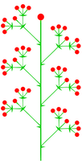

# Thyrse

Inspired by [STROBE], [Noise Protocol], and [Xoodyak], Thyrse is a next-generation cryptographic framework based on the
$\text{Keccak-}f[1600, 12]$ permutation, providing a unified interface for unkeyed and symmetric-key operations. Thyrse
is optimized for modern CPUs (AVX-512, AVX2, NEON/FEAT_SHA3) to provide 10+ Gb/second performance on modern processors
at a 128-bit security level, while still remaining fast enough in software for use on embedded devices.

Two design principles guide the framework. First, replacing separate hash functions, MACs, stream ciphers, and KDFs with
a single sponge construction simplifies the design and implementation of cryptographic schemes--from basic AEAD to
multi-party protocols like OPRFs and handshakes. Second, the security of every scheme reduces to the properties of the
underlying sponge (indifferentiability from a random oracle, pseudorandom function security, and collision resistance),
all bounded by the 256-bit capacity (`2**128` against generic attacks). A single security analysis of the sponge and
permutation layers covers the entire framework.

[STROBE]: https://strobe.sourceforge.io

[Noise Protocol]: http://www.noiseprotocol.org

[Xoodyak]: https://keccak.team/xoodyak.html

## ⚠️ Security Warning

> [!WARNING]
> **This code has not been audited. This design has not been analyzed.** It is experimental and should not be used for
> production systems or critical security applications. Use at your own risk.

## License

MIT or Apache 2.0.
