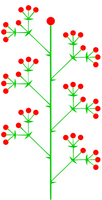

# Thyrse



> [!WARNING]
> **This code has not been audited. This design has not been analyzed.** It is experimental and should not be used for
> production systems or critical security applications. Use at your own risk.

Thyrse is a transcript-based cryptographic protocol framework built on the $\text{Keccak-}f[1600, 12]$ permutation.
Inspired by [STROBE], [Noise Protocol], and [Xoodyak], it replaces the usual grab-bag of hash functions, MACs, stream
ciphers, and KDFs with a single permutation — then builds everything from basic AEAD to threshold signatures on top of
it. Optimized for modern CPUs (AVX-512, AVX2, NEON/FEAT_SHA3), Thyrse delivers 10+ Gb/s on modern processors at
a 128-bit security level while remaining fast enough in software for embedded devices.

The security of every scheme reduces to the properties of the underlying sponge (indifferentiability from a random
oracle, pseudorandom function security, and collision resistance), all at a 128-bit security level ($2^{128}$
against generic attacks). One security analysis covers the entire framework.

[STROBE]: https://strobe.sourceforge.io
[Noise Protocol]: http://www.noiseprotocol.org
[Xoodyak]: https://keccak.team/xoodyak.html

## Schemes

Thyrse ships with a library of ready-to-use cryptographic schemes built on the core `Protocol` type.

### Basic

| Scheme | What it does |
|--------|-------------|
| **digest** | Hash (32 bytes) and HMAC (16 bytes) via `New` / `NewKeyed` |
| **aead** | Authenticated encryption implementing `crypto/cipher.AEAD` |
| **siv** | Nonce-misuse-resistant AEAD (Synthetic Initialization Vector) |
| **aestream** | Streaming authenticated encryption with `io.Reader` / `io.Writer` wrappers |
| **oae2** | Online authenticated encryption with block-based streaming |
| **mhf** | Data-dependent memory-hard function (DEGSample, Blocki & Holman 2025) |

### Complex

| Scheme | What it does |
|--------|-------------|
| **sig** | EdDSA-style Schnorr signatures over Ristretto255 |
| **hpke** | Hybrid public-key encryption (static-ephemeral DH) |
| **signcrypt** | Signcryption — confidentiality, authenticity, and signer privacy in one shot |
| **oprf** | Oblivious pseudorandom function with blinding (RFC 9497-style) |
| **vrf** | Verifiable random function with proofs |
| **pake** | Password-authenticated key exchange (CPace-style) |
| **frost** | FROST threshold signatures (Flexible Round-Optimized Schnorr Threshold) |
| **adratchet** | Asynchronous double ratchet with forward secrecy and break-in recovery |

All schemes are in `schemes/basic/` and `schemes/complex/` respectively.

## Performance

Under the hood, Thyrse accelerates large messages with [TreeWrap] — a tree-parallel authenticated encryption layer
using Sakura flat-tree encoding with kangaroo hopping. TreeWrap cascades across SIMD widths (x1 → x2 → x4 → x8),
saturating available vector units automatically.

| Platform | SIMD | Parallel lanes |
|----------|------|----------------|
| x86-64   | AVX-512 | up to 8-wide |
| x86-64   | AVX2 | up to 4-wide |
| x86-64   | SSE2 | up to 2-wide (fallback) |
| ARM64    | NEON / FEAT_SHA3 | up to 4-wide |
| Any      | Pure Go | all widths (portable) |

Build with `-tags purego` to disable assembly on any platform.

[TreeWrap]: docs/treewrap-spec.md

## The Protocol API

At the core is a `Protocol` — a transcript that accumulates data and derives cryptographic outputs via [KT128]
(KangarooTwelve, RFC 9861).

```go
p := thyrse.New("myapp.v1")
p.Mix("user-id", userID)
p.Mix("nonce", nonce)
ct := p.Seal("message", nil, plaintext)   // encrypt + authenticate
```

Key operations: `Mix`, `Derive`, `Ratchet`, `Mask`/`Unmask`, `Seal`/`Open`, `Fork`/`ForkN`, `Clone`, `Clear`.

See the [full specification](docs/thyrse-spec.md) for details.

[KT128]: https://www.rfc-editor.org/rfc/rfc9861

## License

MIT or Apache 2.0.
